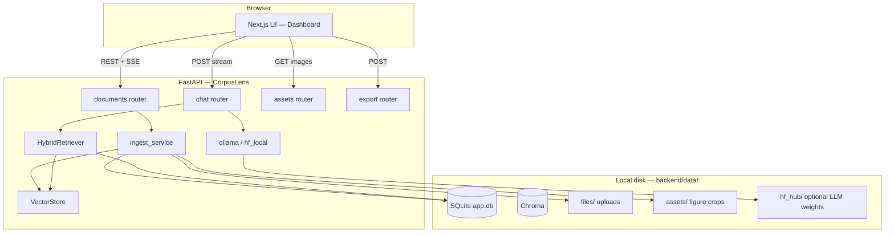

# CorpusLens — system architecture

This document describes how CorpusLens is structured on disk, how subsystems interact, and how data flows through ingest, indexing, retrieval, and generation.

---

## 1. High-level view



**Principles**

- **Single-machine default**: API, UI, SQLite, Chroma, and file store are colocated; no cloud dependency for core RAG.
- **Source of truth for text**: SQLite `chunks` table; Chroma holds embeddings keyed by the same chunk IDs.
- **LLM is pluggable**: Same chat pipeline calls either **Ollama** (`/api/generate`) or **local Hugging Face** causal LM.

---

## 2. Repository directory layout

```
CorpusLens/
├── README.md                 # User-facing overview & quick start
├── LICENSE                   # MIT
├── docs/
│   └── ARCHITECTURE.md       # This file
├── docker-compose.yml        # Optional Ollama in Docker
├── backend/
│   ├── .env.example          # Template for API settings (copy → .env)
│   ├── requirements.txt
│   ├── scripts/              # Helper scripts (HF download, Ollama paths)
│   └── app/
│       ├── main.py           # FastAPI app, CORS, router mount, lifespan → init_db
│       ├── config.py         # Pydantic Settings → env vars
│       ├── database.py       # SQLite schema, CRUD, migrations (e.g. ingest_meta)
│       ├── models/schemas.py # Pydantic request/response models
│       ├── routers/
│       │   ├── documents.py  # Upload, list, delete, reindex, file serve, library reset
│       │   ├── chat.py       # SSE streaming chat + LLM health
│       │   ├── assets.py     # Serve figure images by asset id
│       │   └── export.py     # Markdown export
│       ├── services/
│       │   ├── ingest_service.py   # Orchestrates copy → profile → DB → chunk → Chroma
│       │   └── library_wipe.py     # Full reset: Chroma + SQLite + files + assets
│       ├── ingest/
│       │   ├── pdf.py              # PyMuPDF: text chunks, figure extraction
│       │   └── pdf_profile.py      # Heuristic PDF type (text vs scan-heavy)
│       ├── retrieve/
│       │   ├── vector_store.py     # Chroma collections + sentence-transformers embedder
│       │   └── hybrid.py           # BM25 + vector query + RRF + figure branch
│       └── generate/
│           ├── ollama.py           # Prompt build + stream from Ollama
│           └── hf_local.py         # Local HF model stream
└── frontend/
    ├── .env.local.example
    ├── package.json
    ├── app/
    │   ├── layout.tsx        # Fonts, global body classes
    │   ├── page.tsx          # Renders Dashboard
    │   └── globals.css       # Design tokens + .cl-* utilities
    ├── components/
    │   └── Dashboard.tsx     # Full UI: library, query, answer, evidence
    └── lib/
        └── api.ts            # fetch helpers, API_BASE, types
```

**Runtime data** (not in git; under `backend/data/`)

| Path | Role |
|------|------|
| `app.db` | SQLite: documents, chunks, assets metadata |
| `chroma/` | Persistent Chroma client: `text_chunks`, `figure_captions` collections |
| `files/` | Stored upload binaries (UUID-prefixed names) |
| `assets/{document_id}/` | Extracted figure images + related paths in DB |
| `tmp_upload/` | Short-lived buffer during multipart upload |
| `hf_hub/` | Hugging Face cache when using `hf_local` |

---

## 3. Backend modules (responsibilities)

### 3.1 `main.py`

- **Lifespan**: ensures `data_dir`, `files`, `tmp_upload` exist; runs `init_db(app.db)`.
- **CORS**: reads `cors_origins` from settings (comma-separated).
- **Routers**: `documents`, `assets`, `chat`, `export` under their respective prefixes.
- **Health**: `GET /api/health`.

### 3.2 `config.py` (`Settings`)

- Paths: `data_dir`, `chroma_path`.
- **LLM**: `llm_backend`, `ollama_*`, `hf_*` (model id, tokens, temperature).
- **Retrieval defaults**: `chunk_size`, `chunk_overlap`, `retrieve_k_*`, `bm25_k`, `rrf_k`.
- **Embeddings**: `embedding_model` (SentenceTransformer id).

### 3.3 `database.py`

- **Tables**: `documents` (with optional `ingest_meta` JSON profile), `chunks`, `assets`.
- **Operations**: insert/list/delete documents; insert chunks and assets; stats for empty-library hints; chunk/asset counts for API list.
- **Migrations**: lightweight `PRAGMA`-driven column adds (e.g. `ingest_meta`).

### 3.4 `routers/documents.py`

- **List**: returns `DocumentOut` including `chunk_count`, `asset_count`, parsed `ingest_profile`.
- **Upload**: validates PDF magic bytes / empty file; optional `replace_library` → `library_wipe` then `ingest_uploaded_file`.
- **Reset**: `POST .../library/reset` → wipe Chroma + SQLite documents cascade + delete files tree.
- **Delete / reindex / file download**: per-document lifecycle.

### 3.5 `services/ingest_service.py`

- **Order**: optional full wipe → copy to `files/` → PDF/image profile JSON → `insert_document` → `_ingest_physical_file`.
- **PDF**: `analyze_pdf_profile` → optional **full-page OCR** path for scan-heavy / low-text / empty PDFs (`PDF_OCR_*`); `ingest_pdf_with_figures` → SQLite chunks + `VectorStore.upsert_text_chunks`; figures → `assets` + `upsert_figures`; optional **Ollama vision** captions (`OLLAMA_VISION_MODEL`) merged into figure index text and `description`.
- **Image**: single “virtual” page chunk + optional OCR text; duplicate as figure asset for thumbnails.
- **Failure**: on exception or PDF with zero chunks **and** zero assets, **cleanup** (delete vectors, DB row, file, assets dir) and surface error to client.
- **Reindex**: clears vectors + chunks/assets for doc, re-ingests from stored path, refreshes profile.

### 3.6 `retrieve/vector_store.py`

- **Chroma**: two collections — `text_chunks`, `figure_captions` (cosine space).
- **Embedder**: lazy-loaded `SentenceTransformer(embedding_model)`.
- **Query**: `query_text` / `query_figures` with optional `document_id` filter (`$in` for multiple IDs).
- **Lifecycle**: `delete_document_vectors`, `reset_all` (drop collections, recreate).

### 3.7 `retrieve/hybrid.py` and `retrieve/rerank.py`

- Loads candidate chunks from SQLite (optionally filtered by `document_ids`).
- **BM25** (`rank_bm25`) over chunk texts → top `bm25_k` chunk ids.
- **Dense**: embedding query → Chroma `query_text` → ids + distances (pool widened when `RERANK_ENABLED`).
- **RRF**: fuse BM25 and vector ranked lists.
- **Reconciliation**: follow fused order but drop ids missing in SQLite; **backfill** from DB order if fusion yields too few (handles Chroma/SQLite drift).
- **Reranking**: optional `rerank.py` cross-encoder rescoring of the candidate pool before trimming to `k` (see `RERANK_MODEL`).
- **Figures**: optional branch (query intent or `fast_mode` off) — Chroma figure query + SQLite figure rows.
- **Output**: `text_hits`, `figure_hits`, heuristic `retrieval_confidence`.

### 3.8 `routers/chat.py`

- Normalizes `document_ids` against existing document titles/ids (drops stale IDs).
- **Fast mode**: caps `retrieve_k`, disables figure retrieval.
- **Compare mode**: widens k when ≥2 scoped docs.
- **Empty retrieval**: SSE stream with library stats hint (empty lib, no chunks, scoped miss, or index inconsistency).
- **Non-empty**: `build_messages` (system + user context from `format_context`) → `stream_ollama` or `stream_hf_local` → SSE `token` events → final `done` with evidence payloads.

### 3.9 `generate/ollama.py` & `generate/hf_local.py`

- **Ollama**: flattens chat messages to a single prompt; `POST /api/generate` with `stream: true`.
- **HF local**: loads tokenizer + causal LM; streams new tokens; respects context truncation settings.

---

## 4. Frontend architecture

| Piece | Role |
|-------|------|
| `app/page.tsx` | Single route mounting `Dashboard`. |
| `components/Dashboard.tsx` | All client state: documents, selection scope, upload, chat SSE parsing, modes, Markdown render, evidence tables. |
| `lib/api.ts` | `API_BASE` from `NEXT_PUBLIC_API_URL`; typed helpers; `parseApiErrorText` for FastAPI errors. |
| `app/globals.css` | CSS variables + `.cl-panel`, `.cl-input`, `.cl-btn-*` (avoid `@apply` on custom Tailwind color tokens). |

**SSE handling**: accumulate buffer, split on `\n\n`, parse `data: {...}` JSON; handle `meta`, `token`, `error`, `done`.

---

## 5. End-to-end flows

### 5.1 Upload → indexed

1. `POST /api/documents/upload` writes body to temp file.
2. `ingest_uploaded_file` copies to `data/files/{uuid}_{name}`.
3. PDF/image profile JSON stored on `documents.ingest_meta`.
4. Chunks (+ optional figures) written to SQLite; embeddings upserted to Chroma with metadata `document_id`, page fields.
5. Temp file removed; response returns `DocumentOut`.

### 5.2 Question → answer

1. `POST /api/chat/stream` with message, optional `document_ids`, mode, `retrieve_k`, `detail_level`, `fast_mode`.
2. `HybridRetriever.retrieve` builds `text_hits` / `figure_hits`.
3. Messages built with mode-specific instructions (Markdown tables for summary/compare, etc.).
4. LLM streams tokens; client renders Markdown.
5. Final SSE includes evidence chunk/figure summaries for UI panels.

### 5.3 Full library reset

1. `POST /api/documents/library/reset` or upload with `replace_library=true`.
2. `clear_entire_library`: Chroma `reset_all`; delete all document file paths; `DELETE FROM documents` (cascade chunks/assets); sweep `files/` and `assets/*`.

---

## 6. Security & deployment notes

- **No built-in auth**: bind API to `localhost` / `127.0.0.1` for same-machine use, or `0.0.0.0` on a trusted LAN with CORS locked down; put a reverse proxy + auth in front for wider exposure.
- **Secrets**: `.env` / `.env.local` must not be committed; use `.env.example` only as templates.
- **CORS**: restrict `CORS_ORIGINS` to known front-end origins in production.

---

## 7. Extension points (for contributors)

- **Ingest**: add parsers (e.g. DOCX) beside `ingest/pdf.py`; wire MIME branch in `ingest_service._ingest_physical_file`.
- **Retrieval**: adjust fusion weights in `hybrid.py`; optional **cross-encoder rerank** in `retrieve/rerank.py` (see `RERANK_ENABLED`).
- **LLM**: new backend by implementing a stream generator and branching in `chat.py`.
- **UI**: split `Dashboard.tsx` into smaller components; add routes in `app/` if the product grows beyond a single page.

**Roadmap**: advanced AI features (implemented vs planned) are listed in **[ROADMAP.md](./ROADMAP.md)**.

---

*Last updated with the CorpusLens repository layout; see `README.md` for setup and `backend/.env.example` for tunables.*
